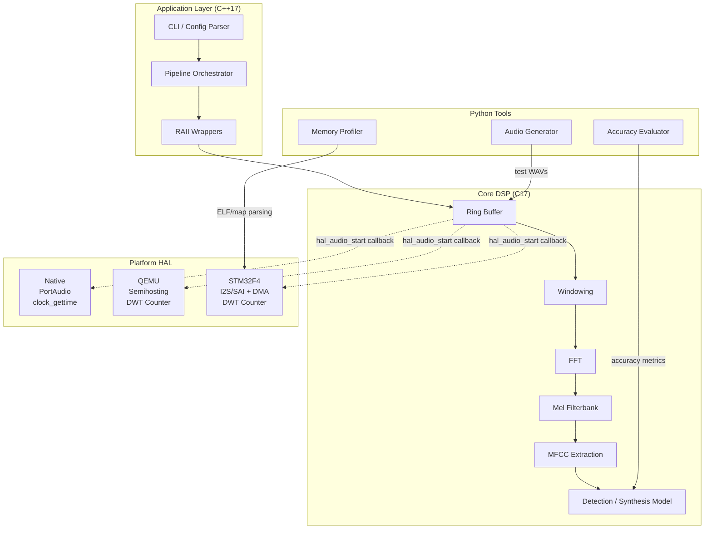
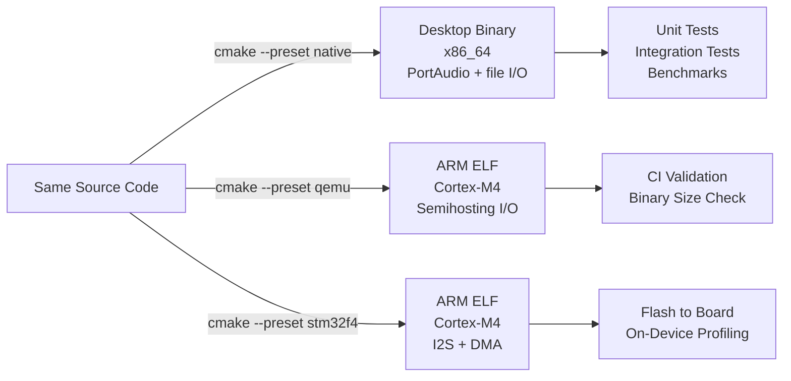

# Architecture

## System Overview



## Data Flow

Audio flows through the system as a stream of fixed-size frames:

```
Mic / File → [Ring Buffer] → [Window] → [FFT] → [Mel] → [MFCC] → [Model]
              16-bit PCM      float32     complex   float    float    decision
              lock-free       Hann/Hamm   radix-2   26-40    13 coef  DTW/etc
                              20-30ms     in-place   filters
```

**Critical constraint:** Everything from Ring Buffer through Model must run
within one audio buffer period. At 16kHz with 256-sample buffers, that's 16ms.

## Memory Map (Embedded Target)

| Region   | Budget  | Contents                                    |
|----------|---------|---------------------------------------------|
| `.text`  | 128 KB  | Code (core DSP + HAL + minimal app)         |
| `.rodata`| 32 KB   | Mel filter coefficients, templates, strings |
| `.data`  | 4 KB    | Initialized globals                         |
| `.bss`   | 16 KB   | Ring buffer, frame buffers, MFCC state      |
| Stack    | 4 KB    | Call stack (no recursion in hot path)        |
| **Total**| **≤184 KB** | Fits in STM32F4 with 256KB SRAM         |

## Build Targets



## Directory Responsibilities

| Directory         | Language | Heap OK? | OS Calls? | Purpose                        |
|-------------------|----------|----------|-----------|--------------------------------|
| `src/core/`       | C17      | No       | No        | Algorithms, math, DSP          |
| `src/app/`        | C++17    | Desktop  | Via HAL   | CLI, orchestration, RAII       |
| `src/platform/`   | C17      | No       | Yes       | HAL implementations            |
| `tests/unit/`     | C17      | OK       | OK        | Unity tests for core           |
| `tests/integration/` | C++17 | OK       | OK        | Pipeline-level tests           |
| `tools/`          | Python   | —        | —         | Audio gen, eval, profiling     |
